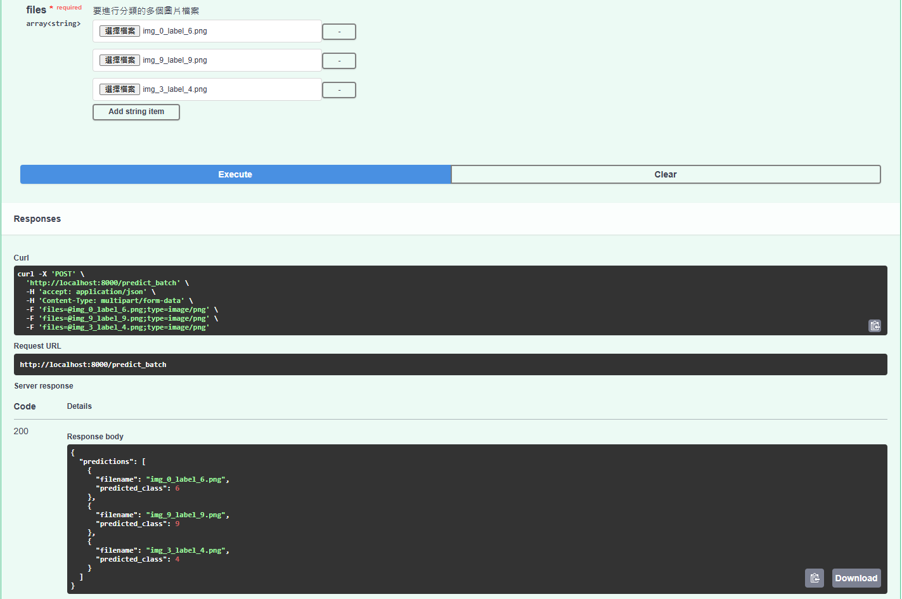

## 🏛️ 架構選擇與考量

本專案採用 FastAPI 搭配 Docker 的架構，主要基於以下考量：

1.  **FastAPI**:
    *   **高效能**: FastAPI 基於 Starlette (ASGI 框架) 和 Pydantic (資料驗證)，是 Python 中執行速度最快的 Web 框架之一，非常適合需要低延遲回應的 AI/ML 模型推論服務。
    *   **異步支援 (`async`/`await`)**: 內建的異步功能可以高效處理 I/O 密集型操作 (如檔案上傳、網路請求) 和大量並發請求，有助於提升系統吞吐量，應對 "開服測試人多不能爆掉" 的需求。
    *   **開發效率與資料驗證**: 使用 Python 類型提示進行資料定義和驗證，程式碼更簡潔、健壯，並能減少執行時錯誤。
    *   **自動化 API 文件**: 自動產生符合 OpenAPI 標準的互動式 API 文件 (Swagger UI at `/docs`) 和 ReDoc 文件 (at `/redoc`)，極大地簡化了 API 的說明、測試和與客戶端工程師的整合工作。

2.  **Docker (容器化)**:
    *   **環境一致性**: 將應用程式及其所有依賴 (特定版本的 Python、函式庫、模型檔案等) 打包到一個隔離的容器中，確保在開發、測試和生產環境中行為完全一致，避免 "在我電腦上可以跑" 的經典問題。
    *   **簡化部署與可移植性**: Docker 容器可以在任何支援 Docker 的環境 (本地機器、測試伺服器、雲平台) 中以相同方式運行，大幅簡化部署流程。
    *   **易於擴展 (Scalability)**: Docker 容器易於與 Kubernetes、Docker Swarm 等容器編排工具整合，方便未來根據流量需求進行水平擴展 (啟動更多服務實例)。
    *   **依賴管理與版本控制**: 所有系統級和 Python 級的依賴都在 `Dockerfile` 和 `requirements.txt` 中明確定義，便於管理和追蹤。

3.  **Gunicorn + Uvicorn Workers (生產環境部署)**:
    *   **生產級 ASGI 伺服器**: 在 `Dockerfile` 的 `CMD` 指令中，我們使用 Gunicorn (一個成熟的 WSGI 伺服器) 來管理多個 Uvicorn worker process (ASGI 伺服器)。
    *   **多進程並發**: Gunicorn 能夠啟動多個獨立的 Uvicorn worker process，每個 process 可以並行處理請求。這有效地利用了伺服器的多核心 CPU 資源，提高了 API 的並發處理能力和整體吞吐量，是應對高流量的關鍵。

4.  **模組化程式碼結構**:
    *   將應用程式邏輯 (FastAPI 路由、模型定義、推論工具函式) 分離到 `app/` 目錄下的不同模組中，遵循關注點分離原則，使得程式碼更易於理解、維護和擴展。

總體而言，此架構旨在提供一個高效能、易於開發、易於部署且具備良好擴展潛力的 AI 推論服務。

## 🗣️ 溝通與交付指南 (針對 PM 與客戶端工程師)

### 給產品經理 (PM) 的說明

"PM 您好，關於圖片判斷功能的 API 已經開發完成並經過了充分測試。我們選擇了 FastAPI 框架和 Docker 容器化技術，主要優勢如下：

1.  **高效能與高並發**：FastAPI 結合 Gunicorn 多進程部署，能有效處理大量用戶的同時請求，滿足開服測試時對穩定性和效能的要求。
2.  **標準化與便捷交付**：整個服務被打包成一個 Docker 映像檔。客戶端工程師只需簡單的 Docker 指令就能在他們的環境中快速啟動服務，確保了環境一致性並降低了部署複雜度。
3.  **清晰的 API 文件**：FastAPI 自動產生了互動式的 API 文件 (可透過 `/docs` 訪問)，客戶端工程師可以非常直觀地了解如何調用 API、傳輸參數以及預期的回應格式。本 `README.md` 也提供了詳細的設定和使用步驟。
4.  **易於擴展**：基於 Docker 的架構為未來服務流量增長時的水平擴展打下了良好基礎。
5.  **已完成事項**：
    *   單張圖片預測 API (`/predict`) 及批次圖片預測 API (`/predict_batch`)。
    *   完整的 Docker 化方案 (`Dockerfile`)。
    *   用於驗證 API 功能的批次測試腳本 (`batch_predict.py`)。
    *   所有程式碼和文件均已上傳至 GitHub [請在此處插入你的 GitHub 儲存庫連結]。

接下來，我將準備一份更詳細的指南，方便客戶端工程師進行部署和整合。"

### 給客戶端工程師的交付與操作指南

**主要交付物**:

1.  **本 GitHub 儲存庫的存取權限/連結**: 包含所有原始碼、`Dockerfile` 以及本 `README.md` 文件。
2.  **(推薦) Docker 映像檔**:
    *   **選項 A (從 Docker Registry 拉取)**: 如果已將映像檔推送到 Docker Hub 或其他私有 Registry，請提供拉取指令：
        ```bash
        docker pull your_dockerhub_username/image-classifier-api:latest # 請替換為實際的映像檔路徑和標籤
        ```
    *   **選項 B (本地建置)**: 請參考本 `README.md` 中的 "[🚀 快速開始 (使用 Docker - 推薦)](#-快速開始-使用-docker---推薦)" 章節，使用 `docker build` 指令自行建置映像檔。

**部署與使用步驟**:

1.  **前置條件**: 確保目標伺服器已安裝 Docker。
2.  **獲取 Docker 映像檔**: 參照上述 "主要交付物" 中的選項 A 或 B。
3.  **啟動 API 服務容器**:
    ```bash
    docker run -d -p <HOST_PORT>:8000 --name my-digit-api your_dockerhub_username/image-classifier-api:latest
    ```
    *   請將 `<HOST_PORT>` 替換為你們希望在主機上映射的 port (例如 `80` 或 `8000`)。
    *   `your_dockerhub_username/image-classifier-api:latest` 應替換為實際的映像檔名稱和標籤。
4.  **驗證服務**:
    *   檢查容器運行狀態: `docker ps`
    *   查看 API 文件: 在瀏覽器中打開 `http://<YOUR_SERVER_IP_OR_DOMAIN>:<HOST_PORT>/docs`
5.  **API 調用**:
    *   請參考本 `README.md` 中的 "[📖 API 使用說明](#-api-使用說明)" 章節，了解各端點的詳細資訊、請求參數、範例請求 (cURL) 和回應格式。
    *   API Base URL 將是 `http://<YOUR_SERVER_IP_OR_DOMAIN>:<HOST_PORT>`。

**注意事項**:

*   模型權重檔案 `model_weights.pth` 已包含在 Docker 映像檔中，無需額外操作。
*   若未來模型或 API 有更新，將會提供新版本的 Docker 映像檔。
*   如在部署或使用過程中遇到問題，請優先查閱容器日誌 (`docker logs my-digit-api`)，並可隨時與我們聯繫。

## 🚀 快速開始 (使用 Docker - 推薦)

### 前置需求

*   [Docker Desktop](https://www.docker.com/products/docker-desktop/) 或 Docker Engine 已安裝並正在運行。
*   Git (用於 clone 專案)。

### 步驟

1.  **Clone 專案**:
    ```bash
    git clone https://github.com/你的GitHub用戶名/image_classifier_api.git # 替換成你的儲存庫 URL
    cd image_classifier_api
    ```

2.  **取得模型權重 (重要!)**:
    將預訓練的模型權重檔案 `model_weights.pth` 放置到專案的根目錄下。
    *注意：由於模型權重檔案可能較大，通常不建議直接將其推送到 Git 儲存庫。你可以考慮使用 Git LFS (Large File Storage) 或者將其存放在外部儲存 (如 S3, Google Cloud Storage) 並在 `README` 中說明如何下載。如果檔案不大 (例如幾十MB)，直接放入也尚可接受。*

3.  **建立 Docker 映像檔**:
    在專案根目錄下執行：
    ```bash
    docker build -t image-classifier-api .
    ```
    (你可以使用自訂的標籤，例如 `yourname/image-classifier-api:latest`)

4.  **執行 Docker 容器**:
    ```bash
    docker run -d -p 8000:8000 --name my-digit-api image-classifier-api
    ```
    *   `-d`: 在背景執行容器。
    *   `-p 8000:8000`: 將主機的 8000 port 映射到容器的 8000 port。
    *   `--name my-digit-api`: 給容器一個自訂的名稱。

5.  **驗證服務狀態**:
    *   檢查容器是否運行: `docker ps` (你應該會看到 `my-digit-api` 正在運行)
    *   查看容器日誌: `docker logs my-digit-api` (確認服務正常啟動)
    *   在瀏覽器中打開 `http://localhost:8000/docs`，你應該能看到 Swagger UI API 文件。

## 📖 API 使用說明

API 啟動後，可以透過瀏覽器或任何 API 測試工具 (如 Postman, cURL) 存取。

*   **API Base URL**: `http://localhost:8000` (當在本機 Docker 運行時)
*   **Swagger UI (互動式 API 文件)**: `http://localhost:8000/docs`
*   **ReDoc (替代 API 文件)**: `http://localhost:8000/redoc`

### 端點 1: `/predict` (單張圖片預測)

*   **Method**: `POST`
*   **URL**: `/predict`
*   **Content-Type**: `multipart/form-data`
*   **Request Body**:
    *   `file`: (必需) 圖片檔案 (例如 PNG, JPG)。
*   **成功回應 (200 OK)**:


      ```json
      {
        "filename": "test_image.png",
        "predicted_class": 7
      }
      ```
*   **cURL 範例**:
    ```bash
    curl -X POST -F "file=@/path/to/your/image.png" http://localhost:8000/predict
    ```

### 端點 2: `/predict_batch` (批次圖片預測 - Bonus)

*   **Method**: `POST`
*   **URL**: `/predict_batch`
*   **Content-Type**: `multipart/form-data`
*   **Request Body**:
    *   `files`: (必需) 一個或多個圖片檔案。在 Postman 或程式碼中，你需要多次指定 `files` 這個 key，並分別上傳不同的檔案。
*   **成功回應 (200 OK)**:


    ```json
    {
      "predictions": [
        {
          "filename": "image1.png",
          "predicted_class": 3
        },
        {
          "filename": "image2.jpg",
          "predicted_class": 9
        },
        {
          "filename": "corrupted_image.png",
          "error": "Cannot identify image file. It might be corrupted or not an image."
        }
      ]
    }
    ```
*   **cURL 範例**:
    ```bash
    curl -X POST \
      -F "files=@/path/to/image1.png" \
      -F "files=@/path/to/image2.jpg" \
      http://localhost:8000/predict_batch
    ```

## 🧪 執行批次預測腳本 (本地測試)

`batch_predict.py` 腳本可以對 `test_images/` 目錄下的所有圖片進行預測，並將結果輸出到 `result.csv`。

1.  **前置條件**:
    *   API 服務正在運行 (無論是在本機直接運行，還是在 Docker 容器中運行並映射到 `localhost:8000`)。
    *   Python 環境已安裝 `requests` 和 `pandas` (如果使用虛擬環境，確保已啟動)。
    *   `test_images/` 目錄下有範例圖片。

2.  **執行腳本**:
    在專案根目錄下，啟動你的 Python 虛擬環境並執行：
    ```bash
    python batch_predict.py
    ```

3.  **檢查結果**:
    腳本執行完畢後，會在專案根目錄下生成 `result.csv` 檔案。

## 🛠️ 本地開發 (不使用 Docker)

如果你想在本地直接運行 FastAPI 應用程式進行開發或測試：

1.  **Clone 專案** (同上)。
2.  **取得模型權重 `model_weights.pth`** (同上)。
3.  **建立並啟動 Python 虛擬環境**:
    ```bash
    python -m venv .venv
    # Windows:
    .\.venv\Scripts\Activate.ps1
    # macOS/Linux:
    source .venv/bin/activate
    ```
4.  **安裝依賴**:
    ```bash
    pip install -r requirements.txt
    ```
5.  **啟動 FastAPI 開發伺服器**:
    ```bash
    uvicorn app.main:app --reload
    ```
    服務將運行在 `http://localhost:8000`。

## 🧹 清理 Docker 資源

*   停止容器: `docker stop my-digit-api`
*   移除容器: `docker rm my-digit-api`
*   移除映像檔 (可選): `docker rmi image-classifier-api`

## 🤝 貢獻

歡迎提交 Pull Requests 或 Issues 來改進這個專案！

## 📄 授權

此專案採用 [MIT License](LICENSE) (如果你選擇了 MIT 授權，請加入一個 `LICENSE` 檔案)。
